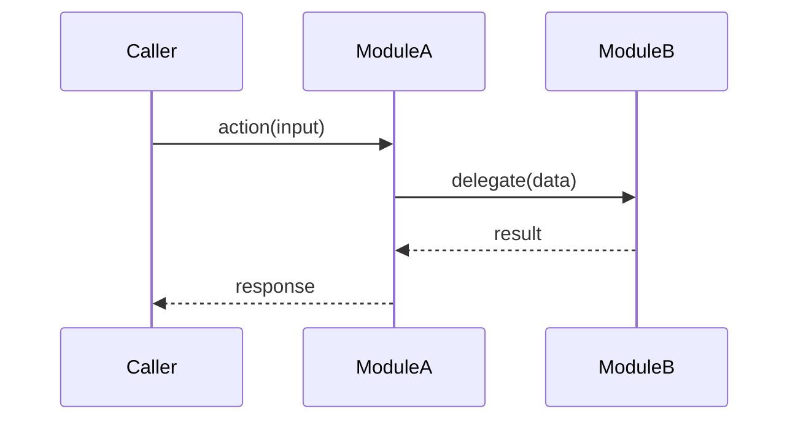

# Flow: `<API / task / callback name>`

> Reviewed at commit: `<hash>` - Last refreshed: YYYY-MM-DD

<!-- One file per entry-point flow. -->

## Trigger

<!-- What starts this flow -- HTTP request (method + route), CLI command, scheduled job, message/event, or callback. Cite the registration point: `path/to/file.ext:line`. -->

## Source file

<!-- Path(s) to the file(s) that implement the entry-point handler for this flow. Cite `path/to/file.ext:line`. -->

## Entry-point function

<!-- The function / method name that receives control first, with its signature. Cite `path/to/file.ext:line`. -->

## Participating modules

<!-- List of modules involved in this flow and the role each one plays. -->

## Sequence diagram

<!-- Mermaid sequence diagram tracing the full control and data path from trigger to response/side-effect. Show every cross-module call. Include error / fallback branches as alt/else blocks where relevant. -->

## Open questions / TODOs

- `TODO(<topic>): <question for the user>`
