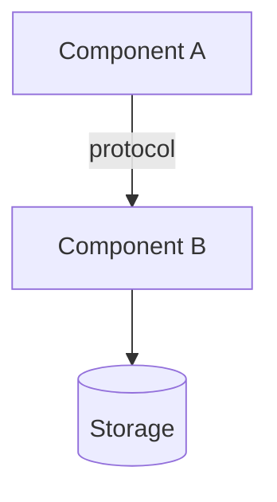

# Project Overview

> Reviewed at commit: `<hash>` - Last refreshed: YYYY-MM-DD

## Purpose

<!-- One paragraph: what this project does, the problem it solves, and what it explicitly does *not* try to do. -->

## Audience

<!-- Who reads this document: new contributors, integrators, operators? What background knowledge is assumed? -->

## High-level architecture

<!-- Prose summary of the major components and their roles, followed by a Mermaid diagram showing how they collaborate and communicate. -->



## Entry points

<!-- Exhaustive list of the system's externally-triggered entry points. For each entry, cite the source file. -->

```
- <function/handler/callback name>
- Kind: HTTP handler / CLI command / cron task / message consumer / callback
- Source: file path
```

```
- <function/handler/callback name>
- Kind: HTTP handler / CLI command / cron task / message consumer / callback
- Source: file path
```

## Open questions / TODOs

- `TODO(<topic>): <question for the user>`
