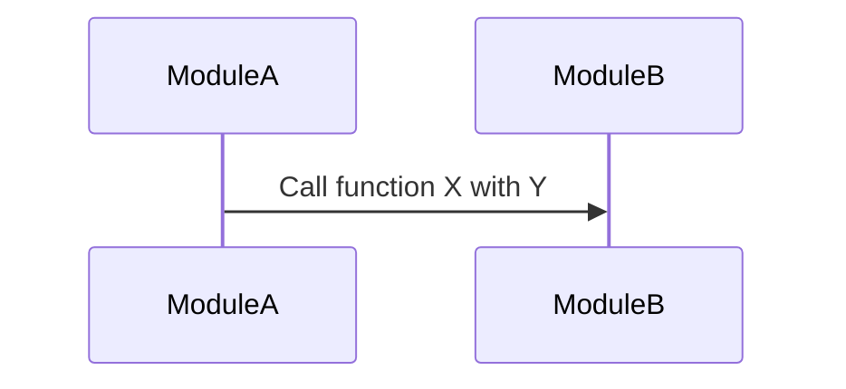

# Integration-test report: `<feature-slug>`

> Run on: YYYY-MM-DD - Framework detected: `<framework>` (`<command used>`)
> Environment: `<container image / local services / fakes used>`

## Logic Path Coverage `<path_name>`

### Sequence Diagram

### Test Tools

- **Test Runner:** `<test runner>` (e.g., `pytest`, `jest`, `go test`, `cargo test`, `rspec`, `xunit`)
- **Environment:** `<container image / local services / fakes used>`

### Scenarios Covered

- **Scenario 1:** Description of the first scenario covered by the tests.
- **Scenario 2:** Description of the second scenario covered by the tests.

### Observations

- **Observation 1:** Any notable observations about the integration tests, such as performance issues, unexpected behaviors, or areas of the code that were particularly difficult to test.
- **Observation 2:** Any insights gained about the system's design or architecture based on the integration testing process.
