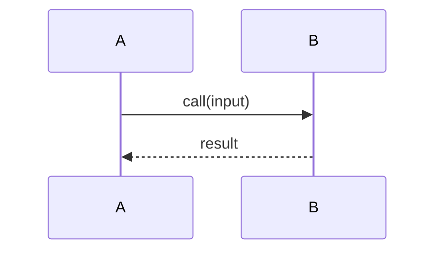

# Feature Spec: `<feature-slug>`

> Created: YYYY-MM-DD
> Source: [user prompt / issue #NNN / RFC link / design-doc path]

---

## Original description

<!-- Paste the user prompt or the verbatim excerpt from the issue, RFC, or design doc here. This is the immutable source of truth for the feature's intended behavior. Do not paraphrase or interpret it away; mark anything unclear with [NEEDS CLARIFICATION: ...]. -->

---

## Feature behavior (WHAT & WHY)

<!-- Describe what the feature should do and why. Do NOT introduce tech-stack choices for net-new components here. Those belong in plan-spec. -->

### Summary

<!-- One or two paragraphs: what this feature does and the user value it delivers. -->

### Functional requirements

<!-- Each FR has a stable ID and describes an independently testable, observable outcome. -->

- **FR-001**: [The system MUST ...]
- **FR-002**: [The system MUST ...]

### Non-functional requirements

<!--Performance, security, privacy, observability, accessibility, etc. -->

- **NFR-001**: [Performance / latency budget, if any.]
- **NFR-002**: [Security / privacy constraint, if any.]
- **NFR-003**: [Observability / accessibility / i18n, if any.]

---

## Current implementation (WHAT EXISTS TODAY)

<!-- Cite real `path:line` references for every claim. Do not invent modules, classes, or functions. Mark anything uncertain with [NEEDS CLARIFICATION: ...] instead of guessing. -->

### Affected modules

<!-- Which modules will the feature touch, and why? -->

- `src/<module-name>/`: [Why this module is relevant to the feature.]

### Existing entry points & interfaces/APIs

<!-- Entry points, functions, or endpoints the feature will modify or extend. -->

- <src_file>:<function_name>: [what it does today and what the feature will change about it.]

### Existing logic

<!-- Describe cross-module flows relevant to this feature using Mermaid sequence diagrams. -->

### Existing data shapes

<!-- Tables, schemas, message types, or config keys the feature will touch, with citations. -->

---

## Recommended implementation (HOW)

## <!-- High-level description of the recommended implementation approach. This is a sketch, not a detailed design doc. The goal is to communicate the general direction and rationale for the implementation, not to specify every detail. -->

---

## Risks & assumptions

<!-- Potential risks, non-obvious assumptions, or uncertainties about the existing code. If none, write "None identified." -->

---

## Open questions / TODOs

- `[NEEDS CLARIFICATION: <question>]`
