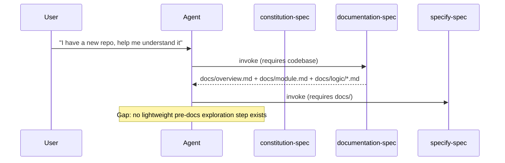

# Feature Spec: `explore-spec`

> Created: 2026-05-26
> Source: user prompt - "evaluate whether a cross-cutting explore-spec skill can be added; it should accept `.speckit/memory/exploration.md` as storage, act as a cross-cutting skill, and all existing skills must mention this cross-cutting step in their workflow background section"

---

## Original description

Evaluate whether the current workflow can be augmented with a helper skill `explore-spec` that can be used when a code repository has no reference documentation at all, or when ingestion work is needed before research begins. The skill should perform workspace exploration. It should accept `.speckit/memory/exploration.md` as its storage directory, act as a cross-cutting skill, and all existing skills must mention this cross-cutting step in their workflow background section.

---

## Feature behavior (WHAT & WHY)

### Summary

`explore-spec` is a new cross-cutting skill that performs a lightweight, breadth-first structural survey of an unfamiliar codebase and writes the findings to `.speckit/memory/exploration.md`. It fills the gap that exists when a repository has no `docs/`, no `spec.md`, no `constitution.md`, and no other anchor artifact that downstream skills require as input. Without `explore-spec`, an agent entering a cold repository must either run the heavyweight `documentation-spec` (which produces a full multi-file doc set) or proceed blindly into `specify-spec` or `research-spec` without any grounded local context.

`explore-spec` is intentionally lighter than `documentation-spec`: it does not trace every entry-point flow end-to-end, does not require Mermaid diagrams for every path, and does not produce the full `docs/` directory. Its output is a single, quickly produced summary that gives every other skill enough orientation to proceed. It is also lighter than `research-spec`: it focuses entirely on the internal codebase structure rather than external evidence or technology comparisons.

In addition to introducing the new skill, this feature requires that every existing skill's Background section be updated to list `explore-spec` as a cross-cutting step alongside `commit-spec`, `audit-spec`, and `research-spec`, so that agents and users know it is available at any point in the workflow.

### Functional requirements

- **FR-001**: The system MUST provide a new skill directory `explore-spec/` (and `zh-cn/explore-spec/`) containing a `SKILL.md` that defines the skill's purpose, inputs, outputs, workflow, quality checklist, draft rules, and handoff guidance.
- **FR-002**: The skill MUST write its output to `.speckit/memory/exploration.md` at the repository root.
- **FR-003**: The output artifact `exploration.md` MUST include at minimum: directory/package layout summary, primary language(s) and framework(s) detected, list of identified entry points (without full flow traces), key external dependencies, and a recommended next-skill suggestion.
- **FR-004**: The skill MUST be designated as a cross-cutting step (not a numbered sequential phase), callable at any point in the workflow - especially before `documentation-spec`, `research-spec`, `specify-spec`, or `constitution-spec` when the repository is cold.
- **FR-005**: Every existing skill's `SKILL.md` Background section (both English and `zh-cn/`) MUST be updated to list `explore-spec` as a cross-cutting step in the "Cross-cutting steps" list alongside `commit-spec`, `audit-spec`, and `research-spec`.
- **FR-006**: The skill MUST NOT duplicate the output of `documentation-spec`; if a complete `docs/` set already exists and is current, the skill SHOULD note this and recommend using `documentation-spec` output directly instead of re-running exploration.
- **FR-007**: The skill MUST include a `templates/exploration.md` template that defines the required sections of the output artifact.

### Non-functional requirements

- **NFR-001**: The exploration workflow MUST be completable in a single agent pass without requiring iterative user confirmation for each directory; the agent should explore autonomously and surface a consolidated clarification message only if critical ambiguity is found.
- **NFR-002**: The output artifact MUST be a single file (`exploration.md`) to keep the memory footprint small and avoid polluting `.speckit/memory/` with many partial files.
- **NFR-003**: The skill MUST follow the same plain-text symbol constraint as all other skills: no emoji, no Unicode decorative punctuation, ASCII equivalents only (except CJK in zh-cn outputs and code/Mermaid blocks).

### Success criteria

- A new cold repository (no `docs/`, no `spec.md`, no `constitution.md`) can be oriented in one skill invocation, producing a `.speckit/memory/exploration.md` that a downstream skill can read as a substitute for `docs/overview.md` when the full doc set does not yet exist.
- All existing skill `SKILL.md` files (English and zh-cn) list `explore-spec` in their Background cross-cutting steps section.
- The `explore-spec` SKILL.md passes the same quality bar as existing skills: every section present, no invented facts, handoff guidance complete.

### Out of scope

- `explore-spec` does NOT replace `documentation-spec`; it does not produce `docs/overview.md`, `docs/module.md`, or `docs/logic/*.md`.
- `explore-spec` does NOT perform external research (GitHub repos, papers, stack comparisons); that is `research-spec`'s domain.
- `explore-spec` does NOT write or amend `constitution.md`; that is `constitution-spec`'s domain.
- `explore-spec` does NOT produce a feature `spec.md`; that is `specify-spec`'s domain.
- `explore-spec` does NOT trace full end-to-end control/data flows with Mermaid sequence diagrams for every entry point; that depth belongs to `documentation-spec`.

---

## Current implementation (WHAT EXISTS TODAY)

### Affected modules

- `constitution-spec/SKILL.md`: Background section lists cross-cutting steps as `commit-spec` and `audit-spec` only; `explore-spec` is absent. (`constitution-spec/SKILL.md:40-43`)
- `documentation-spec/SKILL.md`: Background section lists cross-cutting steps as `commit-spec` and `audit-spec` only; `explore-spec` is absent. (`documentation-spec/SKILL.md:28-31`)
- `specify-spec/SKILL.md`: Background section lists cross-cutting steps as `commit-spec` and `audit-spec` only; `explore-spec` is absent. (`specify-spec/SKILL.md:28-31`)
- `clarify-spec/SKILL.md`: same pattern. (`clarify-spec/SKILL.md`)
- `plan-spec/SKILL.md`: Background section lists cross-cutting steps as `commit-spec` and `audit-spec` only; `explore-spec` is absent. (`plan-spec/SKILL.md:28-31`)
- `tasks-spec/SKILL.md`: same pattern.
- `analyze-spec/SKILL.md`: same pattern.
- `implement-spec/SKILL.md`: Background section lists cross-cutting steps as `commit-spec` and `audit-spec` only; `explore-spec` is absent. (`implement-spec/SKILL.md:28-31`)
- `unittest-spec/SKILL.md`: same pattern.
- `integration-test-spec/SKILL.md`: same pattern.
- `research-spec/SKILL.md`: Background section lists cross-cutting steps as `research-spec`, `commit-spec`, and `audit-spec`; `explore-spec` is absent. (`research-spec/SKILL.md:28-33`)
- `audit-spec/SKILL.md`: same pattern.
- `commit-spec/SKILL.md`: same pattern.
- All corresponding `zh-cn/*/SKILL.md` files mirror the same gap.
- `.speckit/memory/`: directory does not yet exist in the repository; `exploration.md` will be the first file written there by this skill (alongside `constitution.md` when that skill is used).

### Existing entry points & interfaces/APIs

- Each skill's Background section follows a consistent pattern: a numbered list of 10 sequential steps followed by a "Cross-cutting steps" bullet list. The cross-cutting list currently reads:
  - `commit-spec/SKILL.md:40-43`: "Cross-cutting steps (callable at any point in the flow): Commit - ...; Audit - ..."
  - `research-spec/SKILL.md:28-33`: "Cross-cutting steps: Research - ...; Commit - ...; Audit - ..."
  - All other skills follow the same two-item pattern (Commit + Audit).
- The `.speckit/memory/` path is referenced in `constitution-spec/SKILL.md:1` (frontmatter output path) and in `plan-spec/SKILL.md` (optional input), but the directory itself is not created by any skill other than `constitution-spec`.

### Existing logic

### Existing data shapes

- `.speckit/memory/constitution.md`: written by `constitution-spec`; path referenced at `constitution-spec/SKILL.md:1` (frontmatter `outputs` field).
- `specs/<feature-slug>/spec.md`: written by `specify-spec`; path pattern at `specify-spec/SKILL.md:outputs`.
- `docs/overview.md`, `docs/module.md`, `docs/logic/*.md`: written by `documentation-spec`; paths at `documentation-spec/SKILL.md:outputs`.
- No existing `exploration.md` artifact or `.speckit/memory/` directory in the repository.

---

## Recommended implementation (HOW)

1. Create `explore-spec/SKILL.md` following the same frontmatter schema as existing skills (name, description, version, phase). Set `phase: cross-cutting` to match `research-spec`'s convention.
2. Create `explore-spec/templates/exploration.md` with required sections: Exploration summary, Directory layout, Primary language(s) and framework(s), Entry points (list only, no flow traces), Key external dependencies, Gaps and unknowns, Recommended next step.
3. Create `zh-cn/explore-spec/SKILL.md` as the Chinese-language mirror of the English SKILL.md.
4. Create `zh-cn/explore-spec/templates/exploration.md` as the Chinese-language mirror of the template.
5. Update the Background "Cross-cutting steps" list in every existing English `SKILL.md` to add: "Explore - survey an unfamiliar codebase and write `.speckit/memory/exploration.md` when no docs or anchor artifacts exist."
6. Update the Background "Cross-cutting steps" list in every existing `zh-cn/*/SKILL.md` to add the Chinese equivalent.

The update to existing SKILL.md files (steps 5-6) is a mechanical, low-risk text addition: one bullet line per file, 26 files total (13 English + 13 zh-cn).

---

## Risks & assumptions

- **Risk R-001**: The `.speckit/memory/` directory does not exist in the repository yet. The skill must create it on first write. This is low risk but must be stated explicitly in the workflow.
- **Risk R-002**: If `exploration.md` already exists and is current, re-running `explore-spec` should refresh it rather than append to it. The skill must define a clear overwrite policy.
- **Risk R-003**: The boundary between `explore-spec` output and `documentation-spec` output must be kept sharp. If `explore-spec` starts producing Mermaid flow diagrams for every entry point, it becomes a redundant lighter version of `documentation-spec`. The template must explicitly cap the depth of exploration.
- **Assumption A-001**: The `phase: cross-cutting` frontmatter value is acceptable for a new skill; `research-spec` already uses this convention (`research-spec/SKILL.md:5`).
- **Assumption A-002**: All 13 existing English SKILL.md files and 13 zh-cn SKILL.md files follow the same Background section pattern and can be updated with a uniform one-line addition.

---

## Open questions / TODOs

- None identified.
