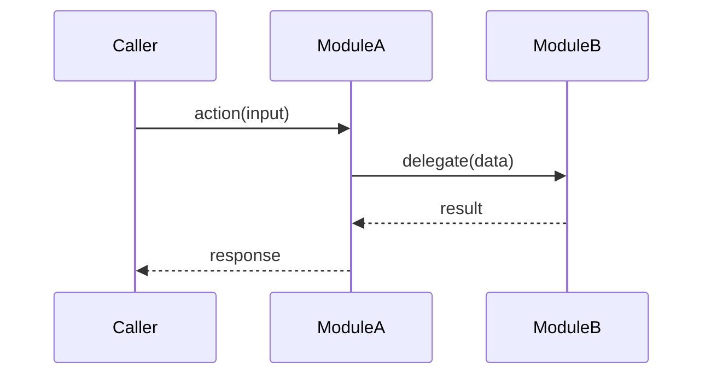

# Flow: `<API / task / callback name>`

> 审阅 commit：`<hash>` - 最近刷新：YYYY-MM-DD

<!-- 每个入口点的 end-to-end flow 单独一份文件。 -->

## Trigger

<!-- 该 flow 如何被触发：HTTP request（method + route）、CLI command、scheduled job、message/event 或 callback。引用注册点：`path/to/file.ext:line`。 -->

## Source file

<!-- 实现该入口点 handler 的文件路径（可能不止一个）。引用 `path/to/file.ext:line`。 -->

## Entry-point function

<!-- 首个接管控制权的函数/方法名及其签名。引用 `path/to/file.ext:line`。 -->

## Participating modules

<!-- 列出该 flow 涉及的 modules，并说明各自角色。 -->

## Sequence diagram

<!-- 用 Mermaid sequence diagram 追踪从 trigger 到 response/side-effect 的完整控制/数据路径。展示每一次跨模块调用；对错误/回退分支，用 alt/else 标注（适用时）。 -->

## Open questions / TODOs

- `TODO(<topic>): <question for the user>`
