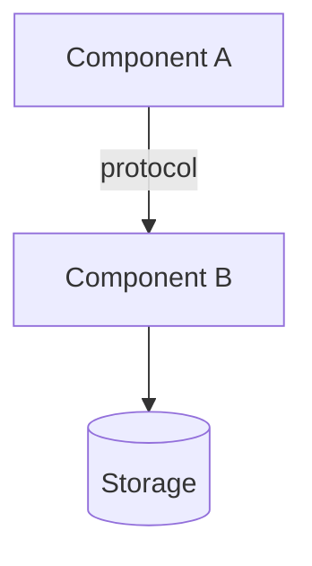

# Project Overview

> 审阅 commit：`<hash>` - 最近刷新：YYYY-MM-DD

## Purpose

<!-- 一段话说明项目做什么、解决什么问题，以及它明确“不做什么”。 -->

## Audience

<!-- 本文档面向谁：新贡献者、集成方、运维人员？默认读者具备哪些背景知识？ -->

## High-level architecture

<!-- 先用文字概述主要组件及其职责，然后给出 Mermaid 图说明它们如何协作与通信。 -->



## Entry points

<!-- 列出系统所有外部触发的入口点。每条入口必须引用源文件。 -->

```
- <function/handler/callback name>
- Kind: HTTP handler / CLI command / cron task / message consumer / callback
- Source: file path
```

```
- <function/handler/callback name>
- Kind: HTTP handler / CLI command / cron task / message consumer / callback
- Source: file path
```

## Open questions / TODOs

- `TODO(<topic>): <question for the user>`
