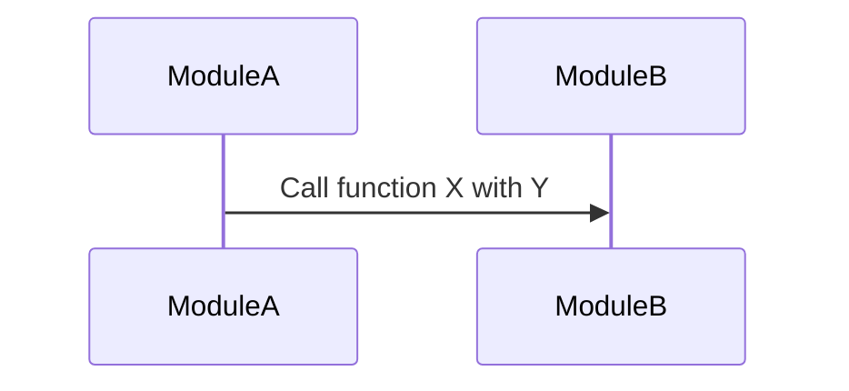

# Integration-test report: `<feature-slug>`

> 运行日期：YYYY-MM-DD - 探测到框架：`<framework>`（`<command used>`）
> 环境：`<container image / local services / fakes used>`

## Logic Path Coverage `<path_name>`

### Sequence Diagram

### Test Tools

- **Test Runner:** `<test runner>` (e.g., `pytest`, `jest`, `go test`, `cargo test`, `rspec`, `xunit`)
- **Environment:** `<container image / local services / fakes used>`

### Scenarios Covered

- **Scenario 1:** 该测试覆盖的第一个场景描述。
- **Scenario 2:** 该测试覆盖的第二个场景描述。

### Observations

- **Observation 1:** 关于集成测试的关键观察，例如性能问题、意外行为、或难以测试的代码区域。
- **Observation 2:** 集成测试过程中对系统设计/架构的洞见与结论。
