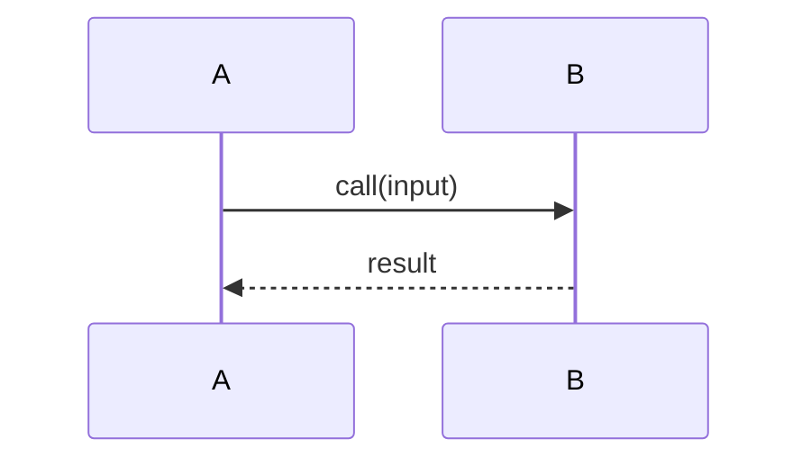

# Feature Spec: `<feature-slug>`

> 创建日期：YYYY-MM-DD
> 来源： [user prompt / issue #NNN / RFC link / design-doc path]

---

## Original description

<!-- 将用户 prompt 或 issue/RFC/design doc 的原文摘录粘贴在此。它是该 feature 预期行为的不可变事实来源。不得用意译把需求“讲没了”；任何不明确之处用 [NEEDS CLARIFICATION: ...] 标注。 -->

---

## Feature behavior (WHAT & WHY)

<!-- 描述 feature 应做什么以及为什么。不要在此为全新组件引入技术栈选择；这些属于 plan-spec。 -->

### Summary

<!-- 1–2 段：描述 feature 做什么，以及它提供的用户价值。 -->

### Functional requirements

<!-- 每条 FR 具备稳定 ID，描述可独立测试、可观测的结果。 -->

- **FR-001**: [The system MUST ...]
- **FR-002**: [The system MUST ...]

### Non-functional requirements

<!-- 性能、安全、隐私、可观测性、可访问性等。 -->

- **NFR-001**: [Performance / latency budget, if any.]
- **NFR-002**: [Security / privacy constraint, if any.]
- **NFR-003**: [Observability / accessibility / i18n, if any.]

---

## Current implementation (WHAT EXISTS TODAY)

<!-- 每条关于现状实现的陈述都必须引用真实 `path:line`。不得编造模块/类/函数；不确定则用 [NEEDS CLARIFICATION: ...] 标注，而不是猜测。 -->

### Affected modules

<!-- 该 feature 会触达哪些 modules？为什么？ -->

- `src/<module-name>/`: [Why this module is relevant to the feature.]

### Existing entry points & interfaces/APIs

<!-- 该 feature 会修改或扩展的入口点、函数或 endpoints。 -->

- <src_file>:<function_name>: [what it does today and what the feature will change about it.]

### Existing logic

<!-- 用 Mermaid sequence diagram 描述与该 feature 相关的跨模块 flows。 -->

### Existing data shapes

<!-- 该 feature 会触达的表/Schema/消息类型/配置键等（需要引用）。 -->

---

## Recommended implementation (HOW)

## <!-- 推荐实现方向的高层描述。这里只是草图，不是详细设计文档；目标是沟通方向与理由，而不是规定每个细节。 -->

---

## Risks & assumptions

<!-- 潜在风险、非显而易见的假设，或对既有代码的不确定性。若无，写 "None identified." -->

---

## Open questions / TODOs

- `[NEEDS CLARIFICATION: <question>]`
